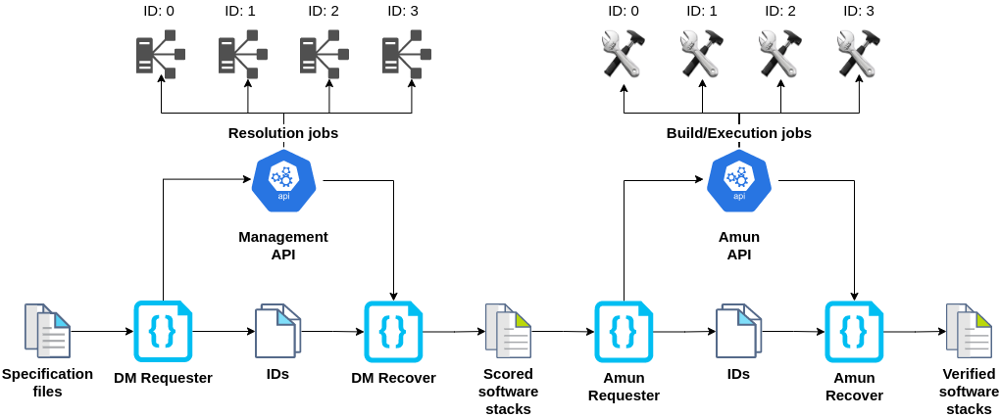

# Loader module

Loader is a Python module we developed to automate sending and gathering requests
from Management and Amun API. It consists of two abstract classes, each having both
Amun and DM implementations. Abstract class Request sends requests to Thoth's service.
Abstract class Recover gathers finished jobs from Thoth's services. Loader consists of
four concrete classes: DM Requester, Amun Requester, DM Recover and Amun Recover.

The process of generating resolution consists of two stages. In the first stage,
we communicate with Management API. DM Requester loads the specification files
manually created and sends them to Management API. This creates resolution jobs and
returns their IDs. DM Retriever takes this IDs and requests scored software stacks
from Management API. In the second stage, we communicate with Amun API. Amun Requester
loads the scored software stacks and creates jobs to build and execute them. IDs are
once again saved into files. Amun Retriever takes this IDs and gatherers all data about
resolution.

Depending on the number of specification files, each stage can take up to several
days to complete. That is why Loader saves IDs in between stages. Our module returns
resolution data in the same format as other Thoth's services. Thus, the data from
Loader can be merged with the datatset provided by RedHat.

This concludes use-cases:
- send request and gather software stacks from DM
- send request and gather inspections from Amun

The config.py file contains configuration for this module.
It sets-up:
 - `AMUN_API`: Base url of Amun API.
 - `AMUN_STATUS`: Url of Amun API status endpoint. Returns status of inspection job.
 - `AMUN_RESULT`: Url of Amun API results endpoint. Returns result of inspection job.
 - `AMUN_SPECS`: Url of Amun API specification endpoint. Returns the parameter on which
    the specification was run.
 - `AMUN_BATCH`: Url of Amun API batch endpoint. Returns the number of software stacks
    inspection contains.
- `AMUN_SPECIFICATION_DIR`: Path to directory containing requests to Amun API.
- `AMUN_OUTPUT_DIR`: Path to directory containing inspections. The result of Amun API
   inspection jobs.
- `AMUN_ID_DIR`: Path to directory containing IDs of requested inspection jobs.
- `DM_API`: Base url of Management API.
- `DM_STATUS`: Url of Management API status endpoint. Returns status of resolution job.
- `DM_RESULT`: Url of Management API results endpoint. Returns result of resolution job.
 - `DM_SPECIFICATION_DIR`: Path to directory containing requests to Management API.
 - `DM_OUTPUT_DIR`:Path to directory containing resolutions. The result of Management API
   resolution jobs.
 - `DM_ID_DIR` :Path to directory containing IDs of requested resolution jobs.
 - `WAIT_TIME`: Wait time for HTTP requests.
 - `MAX_TRIES`: Maximum number of tries to make connection with server.
